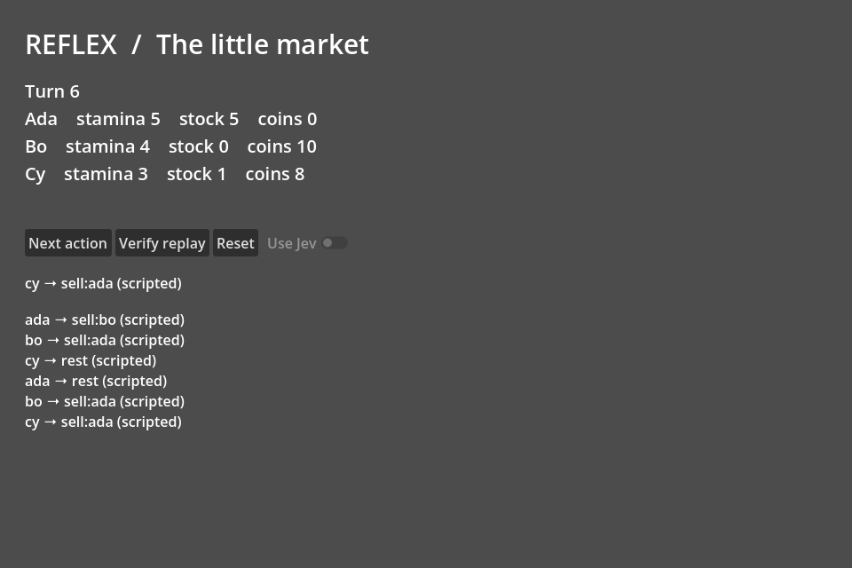

# Reflex Godot

A Godot editor addon and playable NPC decision playground: finite actions, guarded effects, replay checks and an optional Jev adapter.

[](https://github.com/gbesse/reflex-godot/actions/workflows/test.yml)

**Alpha · MIT · Godot 4.7.2 · GDScript · no export/build required.**



## Run it

1. Clone or download this repository.
2. Import `project.godot` in **Godot 4.7.2**, then press Run Project (F5 with the default keymap). The main scene is `demo/playground.tscn`.
3. Click **Next action**. Three actors trade, rest or wait. Resources and the action journal remain visible.
4. Click **Verify replay** to reapply the journal from the fixed demo initial state and compare every resulting state.

The editor's **Reflex** dock opens the playground and creates inspectable `ReflexBehaviorPack` resources. The addon is enabled in this project. To embed it elsewhere, copy `addons/reflex_godot` and enable it under Project Settings → Plugins. The playground button is disabled when the demo is absent. This release uses the Godot 4.7 EditorDock API; older versions are not supported or tested.

## What works

- `ReflexRuntime.actions(actor_id)` exposes only currently legal finite actions.
- `apply(actor_id, action_id, expected_revision, source)` rechecks legality and revision before effects, returning explicit errors for stale or invalid decisions.
- Rest restores capped stamina; greetings spend stamina; trades transfer inventory and coins without creating either.
- Successful actions append state snapshots to an in-memory journal; `verify_replay` detects modified effects or traces.
- A behavior resource holds Jev instructions, a probability threshold and pinned model.
- The optional HTTP adapter validates the model, choice set, probability distribution and threshold. Failed or low-probability decisions apply no action.

The bundled runtime is a small market simulation, not a universal NPC engine, multiplayer authority or arbitrary action plugin registry. Behavior resources customize instructions and thresholds. New action semantics require a runtime extension as described in [the extension guide](docs/plugins.md).

## Try a stale-revision rejection

`godot --headless --path . --script demo/revision_guard.gd` runs a scripted two-action example: `rest` commits at revision 0, then a previously legal `sell:bo` request is rejected against the old revision. The journal has one event and no Jev call is made. This shows the commit-time guard without opening the playground.

## Optional Jev calls

Start Godot from an environment with `TYPESAFE_API_KEY` set. **Use Jev** becomes available. Each click sends the world state and legal actions to the Typesafe `systemone` endpoint with model `jev-1.13.0`. Requests have a 15-second timeout, no redirects and a one-megabyte response limit. The alpha accepts 2–32 actions.

This direct key path is for local development. A shipped game needs a server-side provider gateway; no gateway is included. Never embed a Typesafe key in an exported client. Failures are visible in the UI and Godot error output. Reset is disabled during an in-flight decision.

Live Jev inference has not been tested. The screenshot and included test fixture use scripted decisions. HTTP schema checks do not establish model quality or deterministic live inference.

## Validation

```sh
godot --headless --path . --editor --quit
godot --headless --path . --script tests/runtime_test.gd
godot --headless --path . --script demo/revision_guard.gd
godot --headless --path . --quit-after 3
```

The test script preloads the addon and playground scripts, then checks guarded effects, 100 turns of resource conservation, replay integrity and Jev response validation. CI uses a checksum-verified Godot 4.7.2 Linux binary. None of these commands exports or builds the game.

`tests/preview_capture.gd` renders the included screenshot and needs a graphical display. `docs/playground.png` shows the actual scripted playground after six actions.

## Where this can grow

The shared asset could become a catalog of editable NPC behavior packs, game-specific guarded runtimes and replay fixtures. This alpha establishes the Resource and decision boundaries; it does not claim an existing community or an established competitive moat.
